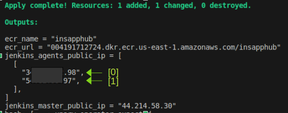

# Insurances App
Get relevant information about insurances

# How to contribute

### Env Variables

Template

# Jenkins Config

Go to url_:9091

Copy pass from /root/.jenkins/secrets/initialAdminPassword

Create Admin User

Create keypairs 

Copy public key in authorized_keys in each agent

Create SSH Credential with the private key

Create agents : 'build-agent' 'deploy-agent'

Use private ip from aws

Add twot environment varibles

ECR_URL=<ecr_url_from_terraform_output_without_ecr_name> ex: XXXXXXXXXXXX.dkr.ecr.us-east-1.amazonaws.com
BASE_URL=<insurance_api_url>

Install plugins
- CloudBees AWS Credentials
- Amazon ECR
- Docker Pipeline

Create a new job
- Pipeline
- Select: GitHub hook trigger for GITScm polling
- Choose Pipeline script from SCM 
- SCM Git
- Repo https://github.com/jpsaavedraguerin/insurances.git
- Credentials none as this is a public repo

Run job

If does not run, and the error is related to docker run: 

sudo usermod -a -G docker ec2-user

Go to <jenkins_agents_public_ip>[1]:9090

### Github config
webhook
create a new webhook
- payload url : http//<jenkins_master_public_id>/github-webhook/

secrets: Save BASE_URL as secret with the value <insurance_api_url>

action : test