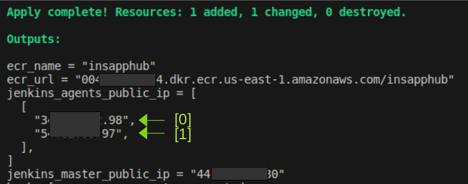

# Insurances App
This app requests and shows relevant information about a given insurance (id:58)

# How to build

The entire infrastructure is automatized and managed with Terraform.

Pre-requisites:
- Terraform
- Create a file secrets.tfvars with the following variables:
    - local_ip=" " // (replace with IP address to use for managing server)
    - public_key_path=" " (replace with the path to the public key created)

To build the infrastructure run the following (inside ```infrastructure/prod/``` folder)

```sh
AWS_PROFILE=<profile_name> terraform plan -var-file=secrets.tfvars
# review the building plan
terraform apply -var-file=secrets.tfvars
# Aprove plan
yes
```
After providing the resources, terraform will inform the name and url of the ECR, the public IP of the two ec2 instances that will be used as jenkins agents and the public IP of the one that will be used as master:



After deploying the app it will be listening in the [1] public ip

# How to configure

## Jenkins

1. Go to `<jenkins_master_public_ip>:9091`
1. Connect to \<jenkins_master_public_ip\> via ssh using the \<private_key\> created to login to aws services
1. Copy the administrator pass from `/root/.jenkins/secrets/initialAdminPassword` to the Jenkins web interface
1. Create a new Admin User and Pass
1. Create SSH keypairs: `ssh-keygen -t rsa -b 4096 -m pem`
    1. Copy public key in the `~/.ssh/authorized_keys` file of each agent
    1. Create a new "SSH Credentials" and copy the private key
1. Create two agents : 'build-agent' 'deploy-agent'
    1. Use private ip from aws
    1. Add two environment varibles:
        - ECR_URL=<ecr_url_from_terraform_output_without_ecr_name> ex: XXXXXXXXXXXX.dkr.ecr.us-east-1.amazonaws.com
        - BASE_URL=<insurance_api_url>   <--the base api url
1. Install jenkins plugins
    - CloudBees AWS Credentials
    - Amazon ECR
    - Docker Pipeline
1. Create a new job
    - Give it a name
    - Choose Pipeline
    - Select: GitHub hook trigger for GITScm polling
    - Choose Pipeline script from SCM 
    - Select SCM : Git
    - Repo URL https://github.com/jpsaavedraguerin/insurances.git
    - Credentials none as this is a public repo

## Github config

1. Save BASE_URL as secret with the value <insurance_api_url>

- There is Git-hub action configured for running test
- There is a webhook (payload url: http//<jenkins_master_public_id>/github-webhook/) that will automaticaly post an update to jenkins every time there is a push. This will trigger a new jenkins job

# How to run
1. Run the job manually the first time
1. If does not run, and the error is related to docker run: 

    ```sudo usermod -a -G docker ec2-user```
    
    Then, run the job again
1. Go to <jenkins_agents_public_ip[1]>:9090

# How to contribute

1. Fork this repo
2. Create a new branch
3. Work on the new feature
4. Write tests
5. Push the changes
6. Create a new pull request (aprovals = 1)

## Git branch strategy
1. The workflow of the project is based on a master branch and several short-lived feature branches. As soon as the new feature is completed, it is merged into the master branch (after passing the tests).
1. There is only one main branch (or trunk).
2. Every new feature is developed in a new branch.
3. Each time a new feature is merged into the master branch, the deployment process starts.
4. The "realeses" are more frequent with smaller changes, which makes the process of detecting bugs easy.


